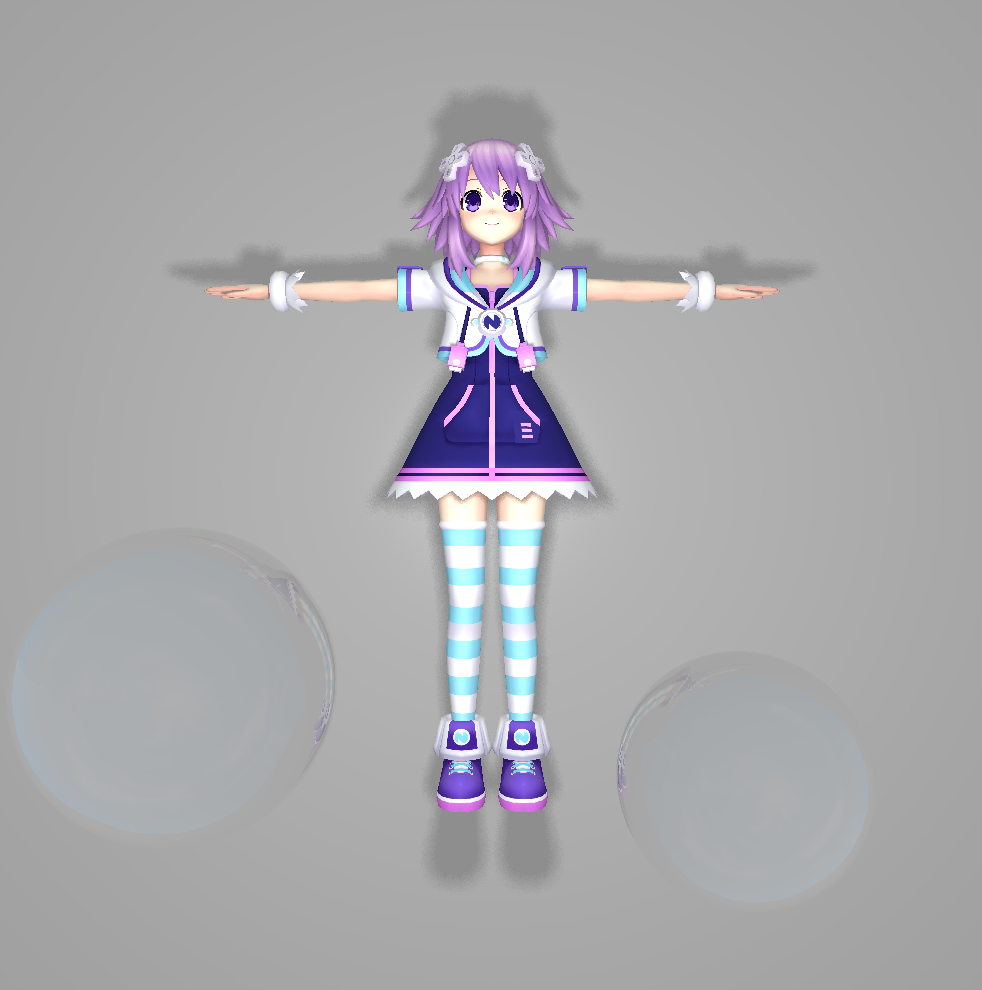

# soft3d

3D renderer on cpu supporting raytracer/rasterizer

## Screenshots

| Bielectric material | Soft shadow |
| :----: | :-----: |
|  |  |

| Reflection | Splines |
| :-----: | :-----: |
|  |  |

## Features

These features are all built from scrath by referring to fundamental of copmuter graphics

- Phong shading
- Reflection
- Shadow
- Soft shadow
- Bielectric material (glass, water)
- 2D curves (Bezier/bspline/nurbs)
- Image filters including Gaussian/bspline filter
- Antialiased texture sampling (spherial/vertex uv)
- Basic graphics pipeline
- Perspective correction
- Parallel shading

## Build 
```
git clone --recursive https://github.com/sunho/soft3d
cd soft3d
cmake --build build
```
build folder will contain the build file (visual stduio project, xcode project, makefile, etc)